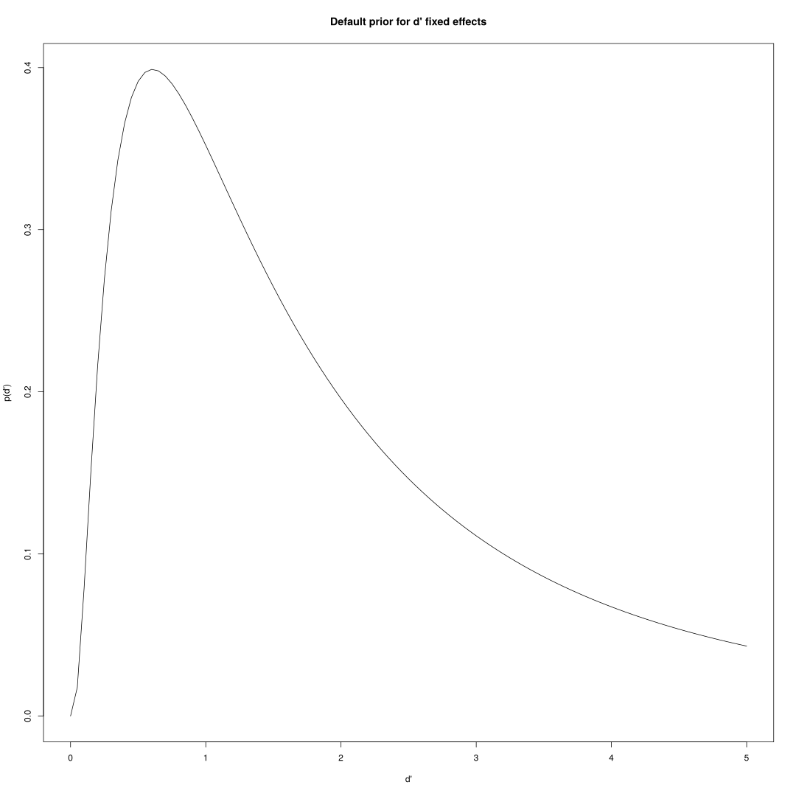
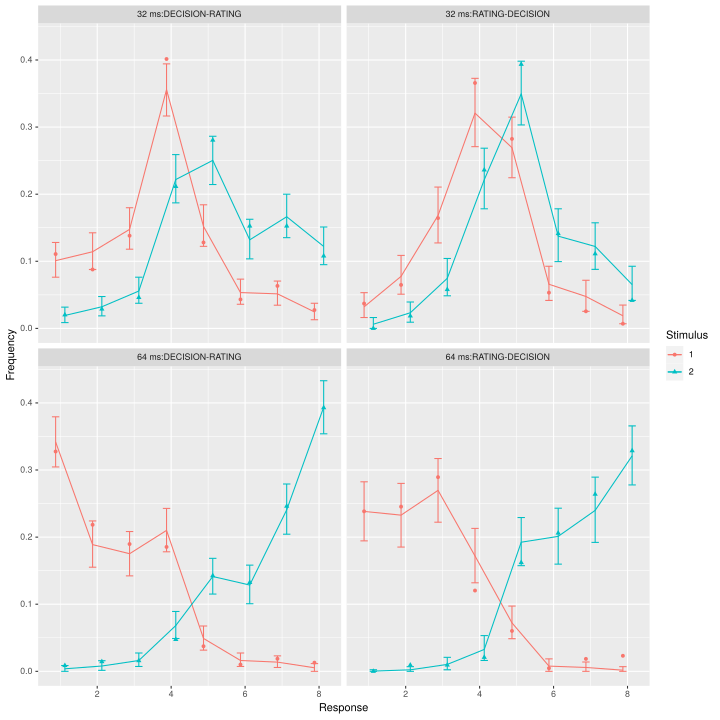
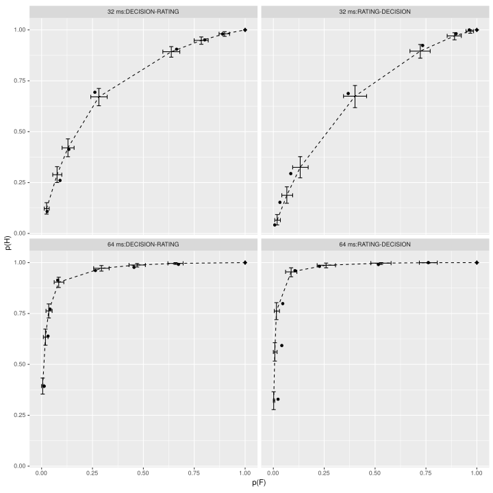
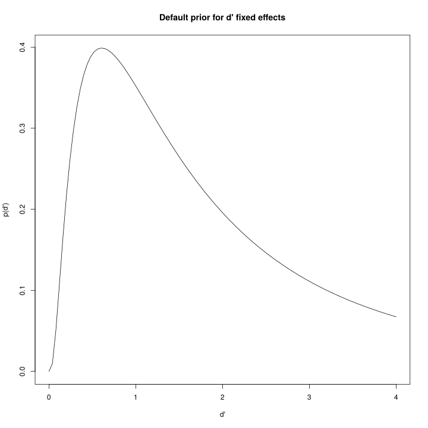

The bhsdtr2 package overview
----------------------------

The bhsdtr2 package implements a new family of (Bayesian hierarchical) generalized linear models that can be used to model ordinal data. The main thing that differentiates the models in this family from other regression models that represent the outcome as a thresholded latent distribution is the new link functions. These functions allow for arbitrary effects in linearly ordered parameters, such as thresholds in Signal Detection Theory or some Item Response Theory models. Thanks to the new link functions such models can become members of the (hierarchical) generalized linear model family.

At present, the package implements Equal-Variance (EV) and Unequal-Variance (UV) Normal SDT, Dual Process SDT (Yonelinas), EV meta-d’, parsimonious (UV and EV) SDT, and meta-d’ (only EV) models (see this [paper](https://link.springer.com/article/10.3758/s13428-019-01231-3) by Selker, van den Bergh, Criss, and Wagenmakers for an explanation of the
term ‘parsimonious’ in this context), as well as more general ordinal models. It uses the state-of-the-art platform [Stan](http://mc-stan.org/) for sampling from posterior distributions. The models can accommodate binary responses as well as ordered polytomous responses and an arbitrary number of nested or crossed random
grouping factors. The parameters (e.g., d’, the thresholds, the ratio of standard deviations, the latent mean, the probability of recall) can be
regressed on additional predictors within the same model via intermediate unconstrained parameters.

This is how a hierarchical SDT model can be fitted:

``` r
gabor$r = combined.response(gabor$stim, gabor$rating, gabor$acc)
m = bhsdtr(c(dprim ~ duration * order + (duration | id),
             thr ~ order + (1 | id)),
           r ~ stim,
           gabor)
```

Note that the only necessary arguments to the bhsdtr function are standard R model formulae and a dataset. Each parameter (here, dprim and thr(esholds)) corresponds to some unconstrained parameter. For example, by default the log link function is used for d’, i.e.,:

log(d’) = delta = some (possibly hierachical) linear regression model

which forces d’ to be non-negative (see [the bhsdtr paper](https://doi.org/10.3758/s13428-020-01370-y) for a detailed explanation of why this is important) and, because log maps the non-negative (0,Inf) interval of possible d’ values into the (-Inf, Inf) interval of all reals, arbitrary positive or negative effects in delta =
log(d’) are possible.

See [this preprint](https://psyarxiv.com/e7a3x/) for more details, including the reasons why the new link functions may be important in psychology 

Prerequisites
-------------

A fairly up-to-date version of [R](https://www.r-project.org/) with the
[devtools
package](https://cran.r-project.org/web/packages/devtools/index.html)
already installed.

Installing the package
----------------------

The bhsdtr2 package, together will all of its dependencies, can be
installed directly from this github repository using the devtools
package:

``` r
devtools::install_git('git://github.com/boryspaulewicz/bhsdtr2')
```

Usage examples
--------------

The package contains the gabor dataset

``` r
library(bhsdtr2)
library(rstan)

## We do not care about the timestamp (the first column)
head(gabor[,-1])
```

      duration trial acc id           order age gender rating stim
    1    32 ms     1   0  4 DECISION-RATING  32      M      1    1
    3    32 ms     3   1  4 DECISION-RATING  32      M      2    0
    4    64 ms     4   1  4 DECISION-RATING  32      M      3    0
    5    64 ms     5   1  4 DECISION-RATING  32      M      2    0
    8    32 ms     8   1  4 DECISION-RATING  32      M      2    1
    9    64 ms     9   0  4 DECISION-RATING  32      M      1    1

Most of the time the models are fitted using the bhsdtr function. The
responses are automatically aggregated by this function to make the
sampling more efficient. All ordinal models reguire an appropriate
response or outcome variable. In the case of binary classification tasks
this is a binary classification decision or a combined response which
represents the binary decision and the rating as a single number. Below,
for demonstration purposes, we create both kinds of responses:

``` r
gabor$r.binary = combined.response(gabor$stim, accuracy = gabor$acc)
gabor$r = combined.response(gabor$stim, gabor$rating, gabor$acc)
## This shows what the two kinds of response variables represent
unique(gabor[order(gabor$r), c('stim', 'r.binary', 'acc', 'rating',  'r')])
```

         stim r.binary acc rating r
    4       0        1   1      3 1
    1064    1        1   0      3 1
    3       0        1   1      2 2
    32      1        1   0      2 2
    1       1        1   0      1 3
    21      0        1   1      1 3
    35      0        1   1      0 4
    52      1        1   0      0 4
    53      0        2   0      0 5
    96      1        2   1      0 5
    34      1        2   1      1 6
    44      0        2   0      1 6
    8       1        2   1      2 7
    36      0        2   0      2 7
    13      1        2   1      3 8
    239     0        2   0      3 8

Here is how you can fit the basic EV Normal SDT model with one threshold
(criterion) to a subsample of the gabor dataset:

``` r
m = bhsdtr(c(dprim ~ 1, thr ~ 1),
           r.binary ~ stim,
           gabor[gabor$order == 'DECISION-RATING' & gabor$duration == '32 ms' &
                 gabor$id == 1,])
```

There is no regression structure here, i.e., we only have one d’ (dprim
\~ 1) and, since we do not use the ratings, we have one threshold (thr
\~ 1). The r.binary \~ stim formula tells the bhsdtr function which
variables represent the response and the stimulus class. Since we did
not add the method = ‘stan’ argument the model is quickly fitted using
the rstan::optimization function. Here are the jmap point estimates of
the model parameters:

``` r
samples(m, 'dprim')
```

    nof. samples: 1
     dprim.1
        0.95

``` r
samples(m, 'thr')
```

    nof. samples: 1
     thr.1
     -0.54

In bhsdtr2, the link-transformed parameters (i.e., delta - d’, metad’,
or R, gamma - the thresholds, theta - the sd ratio, and eta - the mean
of the underlying distribution) have normal priors with default mean and
standard deviation values that depend on the model type and the link
function. If you want to use non-default priors you can alter the
elements of the model object and fit it again using the fit function:

``` r
## Here we introduce strong priors which imply that d' is near zero
m.alt = set.prior(m, delta_prior_fixed_mu = log(.5), delta_prior_fixed_sd = .5)
m.alt = fit(m.alt)
samples(m.alt, 'dprim')
```

    nof. samples: 1
     dprim.1
        0.63

Internally, the priors are specified using matrices:

``` r
m.alt$sdata$delta_prior_fixed_mu
```

               [,1]
    [1,] -0.6931472

In this case there is only one d’ fixed effect (i.e., the intercept),
and d’ has only one dimension (it has two dimensions in the meta-d’
model and in one version of the DPSDT model), so the prior matrices for
the mean and the standard deviation of d’ fixed effects have dimension
1x1. You can provide vectors or matrices of prior parameter values when
calling the set.prior function; The vectors will be used to fill the
relevant matrices in column-major order, the matrices must have the same
dimensions as the paramter matrix.

Here is how you can fit the hierarchical EV Normal SDT model in which we
assume that d’ depends on duration (dprim \~ duration) and order (… \*
order), that both the intercept and the effect of duration may vary
between participants (duration \| id), and the thresholds - which may
also vary between participants (1 \| id) - depend only on order (thr \~
order):

``` r
m = bhsdtr(c(dprim ~ duration * order + (duration | id),
             thr ~ order + (1 | id)),
           r ~ stim, gabor)
```

Here is what happens when we use the samples function on this model:

``` r
samples(m, 'dprim')
```

    nof. samples: 1
                          dprim.1
    32 ms:DECISION-RATING    1.07
    32 ms:RATING-DECISION    1.21
    64 ms:DECISION-RATING    2.89
    64 ms:RATING-DECISION    5.22

Even though the model matrix for the d’ (actually delta) parameter has
an interactive term (duration \* order), the samples function does not
show the difference between the effects of duration caused by order;
instead, it gives *condition-specific* d’ estimates. There are two
reasons for this. Firstly, by default d’ and delta are non-linearly
related by the log / exp function, and exp of a difference is in general
different from the difference of exps. To estimate the difference in d’
one first has to obtain the estimates of d’ *in each condition* and than
calculate the difference, not the other way round. Secondly, one of the
great advantages of having the posterior samples is that arbitrary
contrasts can be computed, which is typically easier when the samples
represent within-condition estimates. For example, this is how we can
calculate the 95% HPD intervals for the effect of duration on d’
averaged over order’:

``` r
## We need to refit the model using the Stan sampler
m.stan = fit(m, method = 'stan')
```

``` r
dprim = samples(m.stan, 'dprim')
## dprim[,1,] because d' has one dimension (it is a scalar) in an SDT model
coda::HPDinterval(coda::as.mcmc(dprim[,1,] %*% c(-.5, -.5, .5, .5)))
```

            lower    upper
    var1 2.131154 2.920363
    attr(,"Probability")
    [1] 0.95

Since the third dimension is named based on the unique combination of
the values of the predictors, you can also do this:

``` r
coda::HPDinterval(coda::as.mcmc(dprim[,1,'64 ms:DECISION-RATING'] - dprim[,1,'32 ms:DECISION-RATING']))
```

            lower   upper
    var1 1.742577 2.58346
    attr(,"Probability")
    [1] 0.95

The object returned by the samples function contains either the point
jmap estimates or the posterior samples. Posterior samples are stored as
a three dimensional array; the first dimension is the sample number, the
second dimension corresponds to the dimensionality of the parameter (d’
has 1, meta-d’ has 2, thresholds have K - 1, sd ratio has 1, latent mean
has 1), and the third dimension corresponds to all the unique
combinations of the predictors that appear in the model formula for the
given parameter.

To fit the UV version of this model you have to introduce the model
formula for the sdratio parameter. Here, for example, we assume that the
ratio of the standard deviations may vary between participants:

``` r
m = bhsdtr(c(dprim ~ duration * order + (duration | id),
             thr ~ order + (1 | id),
             sdratio ~ 1 + (1 | id)),
           r ~ stim,
           gabor)
```

To fit a hierarchical meta-d’ model you just have to replace the dprim
parameter with the metad parameter:

``` r
m = bhsdtr(c(metad ~ duration * order + (duration | id),
             thr ~ order + (1 | id)),
           r ~ stim,
           gabor)
```

The first element of the metad parameter vector is the “type 1”
sensitivity and the second element is the meta-sensitivity:

``` r
samples(m, 'metad')
```

    nof. samples: 1
                          metad.1 metad.2
    32 ms:DECISION-RATING    1.19    1.02
    32 ms:RATING-DECISION    1.40    1.35
    64 ms:DECISION-RATING    2.90    2.54
    64 ms:RATING-DECISION    5.48    5.87

Just by changing the link function for the thresholds you can fit the
parsimonious version of an SDT model (here UV):

``` r
m = bhsdtr(c(dprim ~ duration * order + (duration | id),
             thr ~ order + (1 | id),
             sdratio ~ 1 + (1 | id)),
           r ~ stim, links = list(gamma = 'parsimonious'),
           gabor,)
```

Note that the models that use the parsimonious or the twoparameter link
function represent the thresholds as a two-element vector, so the number
of the thresholds is in general greater than the number of the
corresponding unconstrained gamma parameters in such models.

``` r
samples(m, 'thr')
```

    nof. samples: 1
                    thr.1 thr.2 thr.3 thr.4 thr.5 thr.6 thr.7
    DECISION-RATING -2.31 -1.34 -0.66 -0.07  0.52  1.19  2.17
    RATING-DECISION -2.77 -1.65 -0.86 -0.18  0.50  1.28  2.41

``` r
samples(m, 'gamma')
```

    nof. samples: 1
                    gamma.1 gamma.2
    DECISION-RATING   -0.07    0.14
    RATING-DECISION   -0.18    0.29

You can use the plot method to see how the model fits:

``` r
plot(m)
```



If you used the stan sampler to fit the model you will be able to enjoy
the stan summary table for the unconstrained parameters:

``` r
print(m.stan$stanfit, probs = c(.025, .975),
      pars = c('delta_fixed', 'gamma_fixed'))
```

    Inference for Stan model: 035489421d99243cac4e70e32e5540cb.
    7 chains, each with iter=5000; warmup=2000; thin=1; 
    post-warmup draws per chain=3000, total post-warmup draws=21000.

                      mean se_mean   sd  2.5% 97.5% n_eff Rhat
    delta_fixed[1,1] -0.09       0 0.14 -0.38  0.18  5352    1
    delta_fixed[1,2]  1.21       0 0.11  1.01  1.44  7330    1
    delta_fixed[1,3] -0.29       0 0.22 -0.73  0.15  6974    1
    delta_fixed[1,4]  0.45       0 0.17  0.12  0.78  8744    1
    gamma_fixed[1,1] -0.43       0 0.14 -0.71 -0.15  5394    1
    gamma_fixed[1,2]  0.28       0 0.23 -0.18  0.72  6168    1
    gamma_fixed[2,1] -0.57       0 0.13 -0.82 -0.32  6531    1
    gamma_fixed[2,2]  0.25       0 0.20 -0.15  0.63  7149    1
    gamma_fixed[3,1] -0.04       0 0.11 -0.25  0.17  6393    1
    gamma_fixed[3,2] -0.20       0 0.17 -0.54  0.14  6257    1
    gamma_fixed[4,1]  0.08       0 0.07 -0.07  0.22  7225    1
    gamma_fixed[4,2] -0.19       0 0.12 -0.43  0.04  8277    1
    gamma_fixed[5,1] -0.51       0 0.16 -0.82 -0.21  6411    1
    gamma_fixed[5,2]  0.17       0 0.25 -0.32  0.64  6870    1
    gamma_fixed[6,1] -0.90       0 0.15 -1.19 -0.61  8135    1
    gamma_fixed[6,2]  0.27       0 0.23 -0.19  0.71  8705    1
    gamma_fixed[7,1] -0.22       0 0.10 -0.43 -0.02  7690    1
    gamma_fixed[7,2]  0.21       0 0.17 -0.12  0.55  7923    1

    Samples were drawn using NUTS(diag_e) at Tue Sep 22 20:02:18 2020.
    For each parameter, n_eff is a crude measure of effective sample size,
    and Rhat is the potential scale reduction factor on split chains (at 
    convergence, Rhat=1).

and you will see the predictive intervals in the response distribution
plots:

``` r
plot(m.stan, vs = c('duration', 'order'), verbose = F)
```



and the ROC plots:

``` r
plot(m.stan, vs = c('duration', 'order'), type = 'roc',  verbose = F)
```



Note that if you are interested in the random effects’ standard
deviations or correlation matrices you will have to access the stan
posterior samples directly rather through the samples function.

A warning about the priors for d’ and meta-d’ fixed effects
===========================================================

By default, d’ (meta-d’) are represented as delta = log(d’)
(log(meta-d’)) and the prior on delta is normal. This means that the
*implied* prior on d’ is *log-*normal. This is how the default prior on
d’ fixed effect looks like:

``` r
m = bhsdtr(c(dprim ~ 1, thr ~ 1), r ~ stim, gabor, method = F)
curve(dlnorm(x, m$sdata$delta_prior_fixed_mu, m$sdata$delta_prior_fixed_sd),
      0, 4, main = 'Default prior for d\' fixed effects', xlab = 'd\'', ylab = 'p(d\')')
```



This is perhaps not very informative in typical situations, but this
prior does exclude 0, although in practice posterior d’ samples equal to
0 are not excluded because of the finite precision of floating point
numbers. It is now possible to use a more sophisticated prior for d’ if
the separate intercepts parametrization is used: when using the id\_log
link function for delta, d’ = delta fixed effect \* exp(sum of delta
random effects), which means that delta (fixed effect) = d’, i.e.,
identity link function is used for the d’ / delta fixed effects, but the
random effects are still on the log scale, as they should be.

``` r
m = bhsdtr(c(dprim ~ 1 + (1 | id), thr ~ 1 + (1 | id)), r ~ stim,
           gabor[gabor$duration == '32 ms' & gabor$order == 'DECISION-RATING', ],
           list(delta = 'id_log'))
samples(m, 'dprim')
```

    nof. samples: 1
     dprim.1
        0.92

``` r
## delta_fixed == d' when id_log is used
round(m$jmapfit$par['delta_fixed[1,1]'], 2)
```

    delta_fixed[1,1] 
                0.92 

When this link function is used, the prior on delta fixed effects is a
normal distribution truncated at 0. This way non-negativity of d’ is
preserved, but d’ = 0 is not excluded by the fixed effects’ prior even
in theory. This link function and prior can be especially useful when
e.g., the Savage-Dickey density ratio Bayes Factors are to be estimated
for the d’ or meta-d’ fixed effects to test if they are zero. However,
that the id\_log link function can only be used when there are no
quantitative predictors (i.e., only factors) and the separate intercepts
parametrization is used for the fixed effects, i.e., dprim (or metad) \~
1, or \~ -1 + f1:…:fn, as well as for the random effects, i.e., (1 \|
g), or (-1 + fl:…:fk \| g), where g is the grouping factor.
